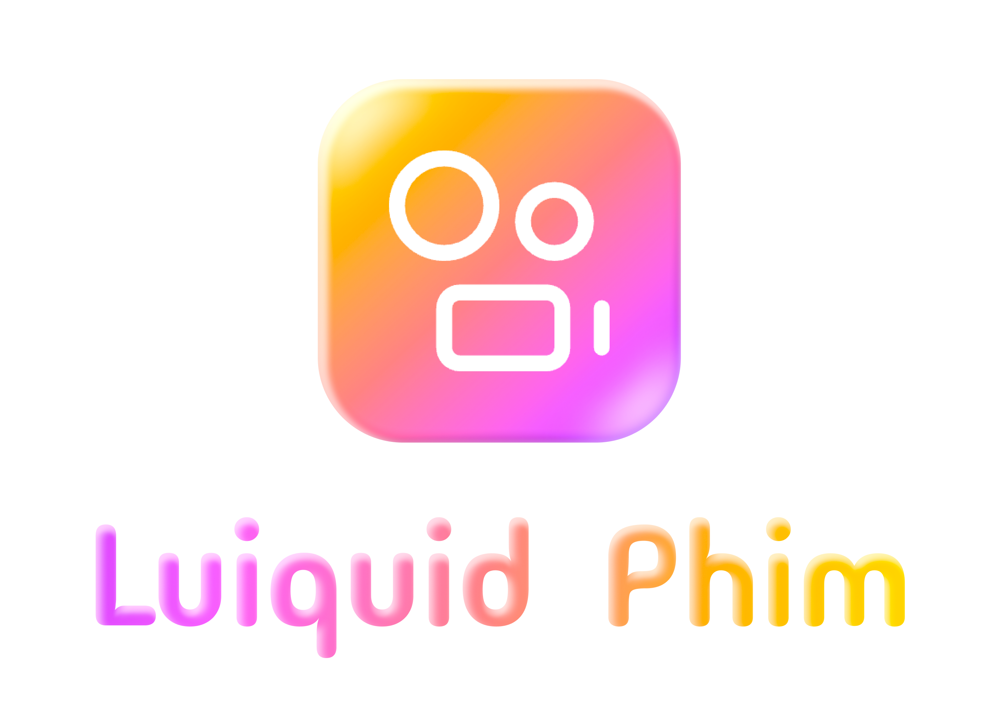

# 🎬 MovieApp

> A beautiful and feature-rich movie streaming application built with Flutter, powered by the kkPhim API.


---
## 🛰️ Logo App
<div align="center">

</div>

---
## ✨ Features

| Icon | Feature | Description |
|:----:|:--------|:------------|
| 🎥 | **Movie Streaming** | Watch movies and TV shows with high-quality video playback |
| 📺 | **Episode Management** | Easily navigate through episodes for series content |
| 🌐 | **Multi-Server Support** | Switch between different streaming servers |
| 🔍 | **Search Functionality** | Find your favorite movies and shows instantly |
| 📱 | **Responsive Design** | Optimized for both mobile and tablet devices |
| 🌓 | **Dark Mode** | Beautiful dark theme for comfortable viewing |
| ⏸️ | **Playback Progress** | Resume watching from where you left off |
| 📺 | **Mini Player** | Continue browsing while watching with picture-in-picture mode |
| 🖼️ | **HD Thumbnails** | High-quality cached images for smooth experience |

---

## 🏗️ Project Architecture

This project follows **Clean Architecture** principles with a clear separation of concerns:

```
lib/
├── 🏛️ core/                          # Core framework and configurations
│   ├── config/                       # App configurations
│   │   ├── themes/                   # Theme definitions
│   │   └── utils/                    # Utility classes
│   ├── models/                       # Base models
│   └── services/                     # Core services
│
├── 🗂️ common/                        # Shared components and helpers
│   ├── components/                   # Reusable UI components
│   │   ├── alert_dialog/             # Custom alert dialogs
│   │   └── bottom_sheet/             # Bottom sheet components
│   └── helpers/                      # Helper utilities
│       └── contants/                 # Constants
│
├── 🎬 feature/                       # Feature modules
│   ├── home/                         # Home screen feature
│   │   ├── data/                     # Data layer
│   │   │   ├── model/                # Data models
│   │   │   └── repository/           # Repositories
│   │   ├── domain/                   # Domain layer
│   │   │   └── usecase/              # Use cases
│   │   └── presentation/             # UI layer
│   │       ├── blocs/                # BLoC state management
│   │       ├── pages/                # Screen widgets
│   │       └── widgets/              # Custom widgets
│   │
│   └── detail_movie/                 # Movie detail feature
│       ├── data/                     # Data layer
│       │   ├── model/                # Data models
│       │   └── repository/           # Repositories
│       ├── domain/                   # Domain layer
│       │   └── usecase/              # Use cases
│       └── presentation/             # UI layer
│           ├── blocs/                # BLoC state management
│           ├── pages/                # Screen widgets
│           │   └── widgets/          # Component widgets
│           └── widgets/              # Custom widgets
│
└── main.dart                         # App entry point
```

### 📁 Directory Structure Explained

| Layer | Purpose | Contents |
|:-----:|:--------|:---------|
| **Presentation** | UI and Widgets | Pages, components, animations |
| **Domain** | Business Logic | Use cases, entities |
| **Data** | Data Access | Models, repositories, APIs |
| **Core** | Foundation | Configs, services, utilities |
| **Common** | Shared Code | Reusable components |

---

## 📦 Dependencies

### 🎨 UI & Animation
| Library | Purpose |
|:--------|:--------|
| 🏞️ `fast_cached_network_image` | High-performance image caching |
| 🎞️ `chewie` | Video player with controls |
| 📽️ `video_player` | Core video playback |
| 🎬 `lottie` | Beautiful animations |
| ✨ `shimmer` | Loading skeleton effects |
| 🎨 `iconsax_flutter` | Modern icon library |

### 🏗️ Architecture & State
| Library | Purpose |
|:--------|:--------|
| 🔗 `get_it` | Dependency injection |
| 📦 `dio` | HTTP client |
| 🌐 `retrofit` | REST API client generator |
| 🔄 `bloc` / `flutter_bloc` | State management |

### 🛠️ Utilities
| Library | Purpose |
|:--------|:--------|
| 🔐 `flutter_dotenv` | Environment variables |
| 📅 `intl` | Internationalization |
| 🎯 `freezed` | Data classes |
| 🧲 `equatable` | Value equality |

---

## 🚀 Getting Started

### Prerequisites

- 🖥️ Flutter SDK 3.5.0 or higher
- ☕ Dart SDK 3.5.0 or higher
- 📱 Android Studio / VS Code

### Installation

1️⃣ **Clone the repository**
```bash
git clone https://github.com/yourusername/movie_app.git
cd movie_app
```

2️⃣ **Install dependencies**
```bash
flutter pub get
```

3️⃣ **Run the app**
```bash
flutter run
```

---

## 🎮 Key Features Breakdown

### 🎥 Video Player
- ▶️ Play/Pause controls
- ⏩ Seek forward/backward
- 🔊 Volume control
- 📏 Auto aspect ratio
- 🖥️ Fullscreen support

### 📺 Episode List
- 📋 Grid view for episodes
- 🔘 Server selection
- 🔍 Quick episode jump
- 📊 Watch progress indicator

### 📱 Mini Player
- 🪟 Draggable video window
- ↗️ Collapse to corner
- 📜 Continue browsing while watching
- 🎯 Tap to expand

---

## 🤝 Contributing

Contributions are welcome! Please feel free to submit a Pull Request.

1. Fork the repository
2. Create your feature branch (`git checkout -b feature/AmazingFeature`)
3. Commit your changes (`git commit -m 'Add some AmazingFeature'`)
4. Push to the branch (`git push origin feature/AmazingFeature`)
5. Open a Pull Request

---

## 📝 License

This project is licensed under the MIT License - see the [LICENSE](LICENSE) file for details.

---

## 📧 Contact

Have questions or suggestions? Feel free to reach out!

- 📘 **Facebook**: [kin240705](https://www.facebook.com/kin240705?locale=vi_VN)
- 📬 **Email**: trungkien24072005@gmail.com
- 🐙 **GitHub**: [My GitHub Profile](https://github.com/kienit2407)

---

## 🙏 Acknowledgments

- 🎬 [kkPhim](https://kkphim.com) for providing the movie API
- 🦋 [Flutter](https://flutter.dev) for the amazing framework
- 🌟 All contributors and supporters

---

<p align="center">
  Made with ❤️ by <a href="https://github.com/kienit2407">Trung Kien</a>
</p>
